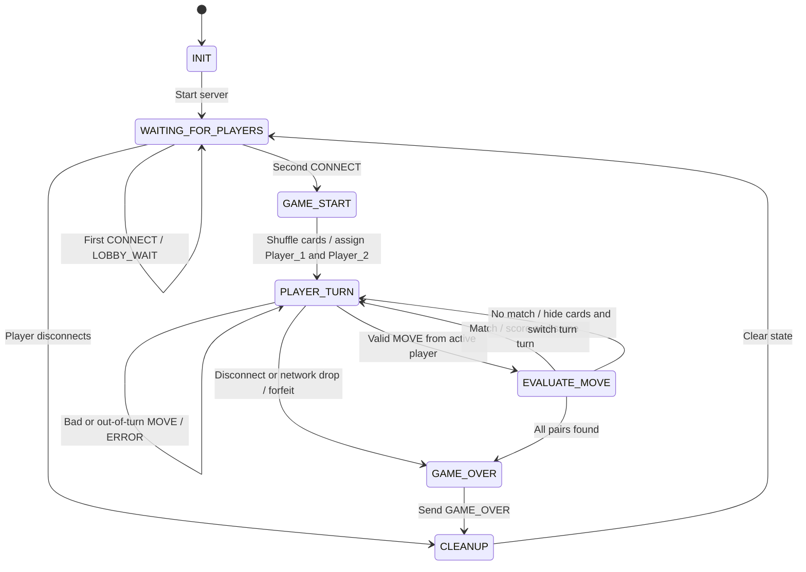

# Pet Memory Match FSM

- `INIT`: Start the server.
- `WAITING_FOR_PLAYERS`: Wait for two clients.
- `GAME_START`: Shuffle eight cards, assign players, and set scores to zero.
- `PLAYER_TURN`: Wait for the active player’s move.
- `EVALUATE_MOVE`: Check the two selected cards and send `STATE_UPDATE`.
- `GAME_OVER`: Send the final win, tie, or forfeit result.
- `CLEANUP`: Close sockets, clear state, and return to the lobby.

Invalid, duplicate, already matched, malformed, and out-of-turn moves send `ERROR` and stay in `PLAYER_TURN`. A normal disconnect, TCP EOF, or socket error counts as a disconnect. An in-game disconnect gives the opponent a forfeit win.
