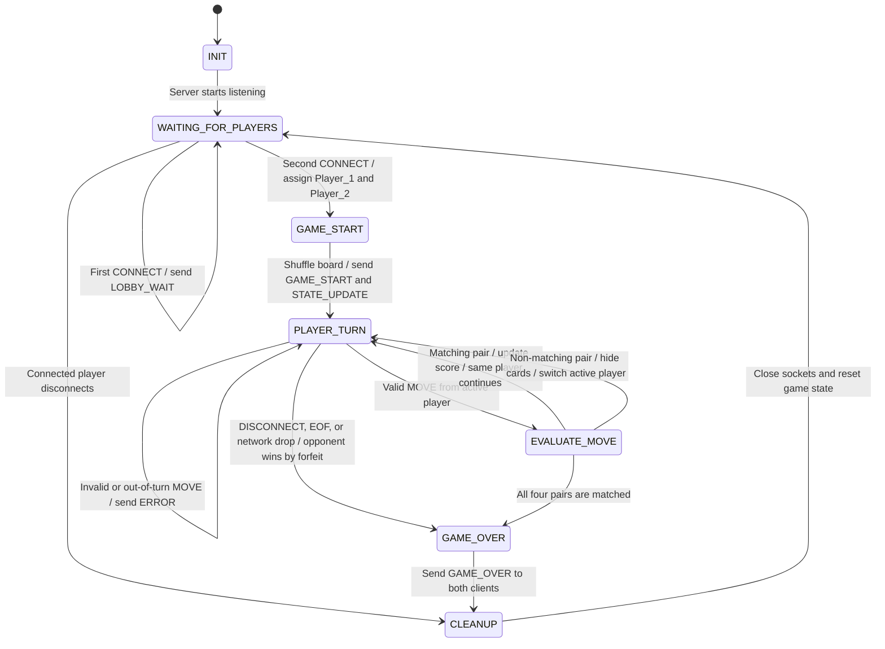

# FSM Specification: Pet Memory Match

## 1. Purpose

This document defines the server-side finite state machine (FSM) for Pet Memory Match. The server is authoritative and controls player connections, turn order, card visibility, scores, valid moves, game completion, and disconnect handling.

## 2. Mermaid State Diagram

## 3. State Definitions

| State | Description |
| --- | --- |
| `INIT` | The server process begins and prepares its game variables and listening socket. |
| `WAITING_FOR_PLAYERS` | The server waits for two clients. The first client receives a `LOBBY_WAIT` message. |
| `GAME_START` | The second client connects. The server assigns `Player_1` and `Player_2`, shuffles the eight cards, and sets both scores to zero. |
| `PLAYER_TURN` | The server waits for a `MOVE` message from the active player. |
| `EVALUATE_MOVE` | The server validates the selected positions, reveals the two cards, checks for a match, updates state, and sends a `STATE_UPDATE`. |
| `GAME_OVER` | All pairs have been matched, or a player has disconnected after the game began. The server sends final results. |
| `CLEANUP` | The server closes client sockets, clears the board and scores, and returns to the lobby state. |

## 4. Move and Error Handling Rules

1. Only the active player may send a `MOVE` message.
2. A move must contain exactly two different board positions.
3. Both selected positions must exist on the 2-by-4 board.
4. Neither selected card may already be part of a matched pair.
5. If a move is invalid or arrives from the wrong player, the server sends an `ERROR` message only to that client and remains in `PLAYER_TURN`.
6. If the selected cards match, the server gives the active player one point and keeps that player active for another turn.
7. If the selected cards do not match, the server briefly reveals both cards to both players, hides them again, and changes the active player.
8. After every valid move, the server sends a `STATE_UPDATE` to both clients.
9. When all four pairs have been matched, the player with the most points wins. Equal scores result in a tie.

## 5. Disconnect and Socket Lifecycle Rules

### 5.1 Graceful Disconnect

A player can intentionally leave by sending a `DISCONNECT` message. If the game has started, the remaining player wins by forfeit. The server sends `GAME_OVER`, enters `CLEANUP`, and returns to `WAITING_FOR_PLAYERS`.

### 5.2 TCP EOF

If a socket `recv()` call returns `b""`, the server treats it as TCP EOF. This means the remote client closed its connection. The server must stop reading from that socket, close it, and handle the player as disconnected.

### 5.3 Abrupt Network Drop

If a player process crashes or a CML network link fails, socket operations may raise `ConnectionResetError`, `BrokenPipeError`, or `ConnectionAbortedError`. The server catches these errors, treats the client as disconnected, awards a forfeit win to the remaining player if the game had started, and cleans up resources.

### 5.4 Disconnect Before Game Start

If the only connected player disconnects while the server is still in `WAITING_FOR_PLAYERS`, no forfeit is declared. The server removes that player and continues waiting for two clients.
